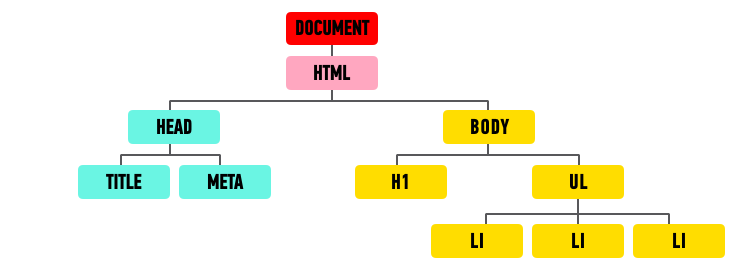

**WDI Fundamentals Unit 5**

---
#Manipulating the DOM

We mentioned before that when a browser retrieves the HTML for a page it makes a model of that page in memory. This model is called the DOM and each element in the HTML document is represented by a DOM node — an object that can be interacted with using JavaScript.

<br>
<center></center>
<br>

JavaScript comes with some "built-in" functions that will allow us to access and update these nodes. We can call on these functions using dot notation. These functions are no different than the functions we just covered, but they are more commonly known as **methods**.

##Accessing Elements

First things first! Before we can do something with an element, we first need to *find* the DOM node that represents the element that we want to work with.

In order to find an element, we need to search through the document for that element. The syntax for searching for an element looks like this:

```js
document.getElementById('main')
```

Let's break this down.

* `document` - Refers to the document object. Any time we want to find an element or elements, we'll need to access them through the document object. This will allow us to search the entire DOM tree for an element. `document` will always be the first part of our query.

* `.` - The dot ties the method on the right hand side (`getElementById`) with the object on the left hand side (`document`).

* `getElementById()` - This is the method we want to use to find an element. We'll take a look at the methods that are available to us shortly. This method in particular lets us locate an element by the valud of its `id` attribute.

* `'main'` - Just like with the functions we've learned about, we can pass in parameters for these methods to use. In this case, we want to find an element that has an `id` value of `main`.

###Selecting an Individual Element

There are a couple of methods we can use to locate an individual element.

**`getElementById()`**

The fastest route to finding any single element is `getElementById()`. Since `id`s are unique, meaning two elements cannot have the same value for an `id` attribute in any given HTML page, this query will allow us to quickly find an individual element.

```html
<div id="sidebar">
	<h1>Related Articles</h1>
	<ul>
		<li><a href="">Article One</a></li>
		<li class="special"><a href="">Article Two</a></li>
		<li><a href="">Article Three</a></li>
	</ul>
</div>
```

```js
document.getElementById('sidebar')
```

In the above example, we are finding the element that has an `id` value of `sidebar`.


**`querySelector()`** is a recent addition to the DOM and is not supported by older browsers. It allows us to use our CSS selector syntax to find an element. If there are multiple elements on the page that match the selector, it will return the first of the matching elements.

```js
document.querySelector('.special')
```

In this example, we are finding the first element that has a `class` attribute with the value `special`.


###Selecting Multiple Elements

Sometimes we'll want to find and work with several elements at once. There are several methods we can use that will return a nodelist, or list of node objects, we can work with.

For each example, you can use this HTML snippet as a reference:

```html
<div id="sidebar">
	<h1>Related Articles</h1>
	<ul>
		<li><a href="">Article One</a></li>
		<li class="special"><a href="">Article Two</a></li>
		<li class="special"><a href="">Article Three</a></li>
	</ul>
</div>
```

**`Document.getElementsByClassName()`**


**`Document.getElementsByTagName()`**

**`Document.querySelectorAll()`**


###Traversing the DOM

	In an HTML document, elements can be nested inside of other elements. Here we have three `<li>` elements that are enclosed within an opening `<ul>` tag and closing `</ul>` tag.

	In programming, relationships between the document and elements are often described in similar terms as one would use to describe a family tree.

	Here we could describe the relationship between the `<ul>` element and the three `<li>` elements as that of *parent* and *children* since the `<li>` elements are enclosed within the `<ul>`.

	Similarly, the three `<li>` elements could be described as *siblings* since they have the same parent element (the `<ul>`).

	Zooming out a bit, we could describe the relationship between the document (an object representing the entire page) and the `<li>` elements as that of *ancestor* and *descendants*.

	parentNode()
	previousSibling() nextSibling()
	firstChild() lastChild()


##Manipulating the DOM

	document.createElement()
		- `createElement` is the method it comes with
		  - This method performs the functionality of creating a new HTML element.
		  - Just like with the functions we've learned about, we can pass in arguments for these methods to use.
		In this case, we passed `createElement` and argument of `'div'` so a `div` element is created. If you'd like, you can go ahead and run that line of code, `document.createElement('div')`, in your browser's console to get see it in action.

	Content

	innerHTML()
	textContent()
	appendChild()
	removeChild()
	createElement()


	className()
	id()
	hasAttribute()
	getAttribute()
	setAttribute()
	removeAttribute()


Any time we'd like to work with an element multiple times, a variable should be used to store, or **cache**, the results of our query. When we store an element in a variable, what we are doing behind the scenes is storing a reference to the location of the element in the DOM tree. We can then use any methods we would normally use on an element on that variable.

---

Let's get some practice accessing and updating the DOM in [the next exercise.](09_exercise.md)