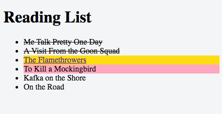

**WDI Fundamentals Unit 5**

---

## Your Turn

Here's the [starter code](https://jsfiddle.net/24b0uy1s/) for your next exercise.

In this exercise we're going to practice manipulating the DOM by updating our Reading List site, which is a little outdated.

For now, we'll run our JavaScript to update the DOM when the page loads. In the next lesson we'll take a look at how we can update the page based on the user's actions. Maybe we'll add a list item when the user clicks on a button. Or maybe we'll remove a list item when the user clicks on an 'X' icon.

Instructions

1. Let's get started! Some starter code has been provided in jsfiddle for this exercise.
2. Write the code to perform the actions listed below in the 'js' panel.
3. Click 'run' to see the results in the 'result' panel.

### Let's get started!

* Use the `querySelectorAll()` method to select all elements that have the `current` class. Using array syntax, find the first element that has the `current` class and update the text content to "Me Talk Pretty One Day".

* Use the `getElementById()` method to find the element that has the id `next`. We want to add a link to this book so we can purchase it. Change the inner HTML of this element to include an anchor: `<a href="http://www.amazon.com/Flamethrowers-Rachel-Kushner/dp/1439142017/ref=sr_1_1?ie=UTF8&qid=1458897183&sr=8-1&keywords=the+flamethrowers">The Flamethrowers</a>`

* Let's add another book to our list! Use `createElement()`, `appendChild()`, `textContent` to add a fifth `<li>` that has the text 'On the Road'.

* We've finished reading *Me Talk Pretty One Day* and *A Visit From the Goon Squad*! Use the `querySelectorAll()` to find all elements that have the `current` class. Then use a for loop to iterate through these elements and change the class name to `finished`.

* Now onto our next book on the reading list, *The Flamethrowers*. Use the `querySelector()` method to find that list item. Update the class name to `current`. Then use the `removeAttribute()` method to remove the id attribute.

* Now use whatever methods/properties are appropriate to find the fourth list item and update the id attribute to `next` using the `setAttribute()` method .

 

 

---

Nice work! [Let's dig in a little deeper.](10_lesson.md)