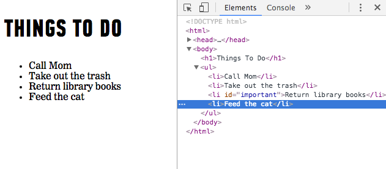
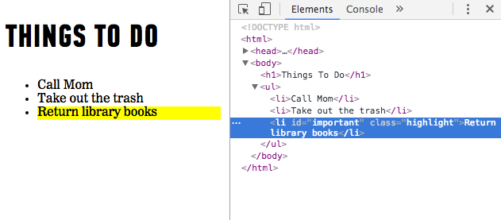

####**`createElement()` and `appendChild()`**

To add new elements to the page, we'll use a three step process.

1. We will use the `createElement()` method to create a new element, which can then be added to the page. When this node is created, it will be *empty*. This element will be stored in a variable
2. We will then add content to the element using the `innerHTML` or `textContent` properties we looked at in the last lesson.
3. Now that our element has been created we can add it as a child of an element using the `appendChild()` method.

To add a fourth item to our list we can execute the following code:

```js
// First up, let's create a new list item and store it in a variable.
var newListItem = document.createElement('li');

// Alright! Now let's update the text content of that list item.
newListItem.textContent = 'Feed the cat';

// And Finally...let's add that list item as a child of the ul.
document.getElementsByTagName('ul')[0].appendChild(newListItem);

```
<br>
<center></center>
<br>

It takes a few steps but you'll get the hang of it in no time.

### Getting and Setting Attributes

We might also want to update styles and attributes for elements on the page. We can do so using the following properties and methods:

####`className`
We can change the value of a class attribute for an element using the `className` property. This will apply any styles in our CSS that are associated with that particular class.

For example, maybe we want to highlight an important task in our list. We can add a class and styles in our CSS like so:

```css
.highlight {
	background-color: yellow;
}
```

And then we can use JavaScript to add this class:

```js
document.getElementById('important').className = 'highlight';

```

The `.highlight` class will then be added to the element with the id `important` and the background-color associated with this class will be applied:

<br>
<center></center>
<br>

####`setAttribute()`, `removeAttribute()`

We can set and remove attributes from elements using the `setAttribute()` and `removeAttribute()` methods.

For example, if we want to update the `href` attribute on an anchor, we could do the following: 

```js
document.getElementsByTagName('a')[0].setAttribute('href', 'http://newurl.com');

```

Or if I wanted to remove an id from an element I could execute the following:

```js
document.getElementsByTagName('a')[0].removeAttribute('id');

```

#Conclusion

Phew! There are so many properties and methods that it can be overwhelming at first! The important thing at this stage is that you understand how things work and know what tools are available to you. Memorization comes with practice!


##Caching a query

> **NOTE** If we'd like to work with that element multiple times, a variable should be used to store, or **cache**, the results of our query. When we store an element in a variable, what we are doing behind the scenes is storing a reference to the location of the element in the DOM tree. We can then use any methods we would normally use on an element on that variable.
AddEventListener()

---

Think you've got it? [Get some practice in the next exercise.](11_exercise.md)