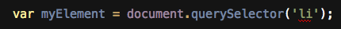
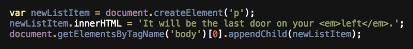
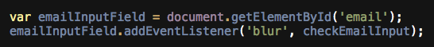

1. How would I find the second element on the page that has a `class` of `special`?

(User will type answer)

2. What will the following code do?

 

 

A. Select the element that has a class name `li`.
B. Select all list items on the page.
C. Select the first list item on the page.
D. Select the last list item on the page.

3. What will the element that gets appended to the page look like?
 

 

(User will type answer)

4. What does 'blur' indicate?

 

 

A. It is the name of a function.
B. It selects an element that has the class 'blur'.
C. It is the type of event we are listening for.
D. It is the name of a variable.